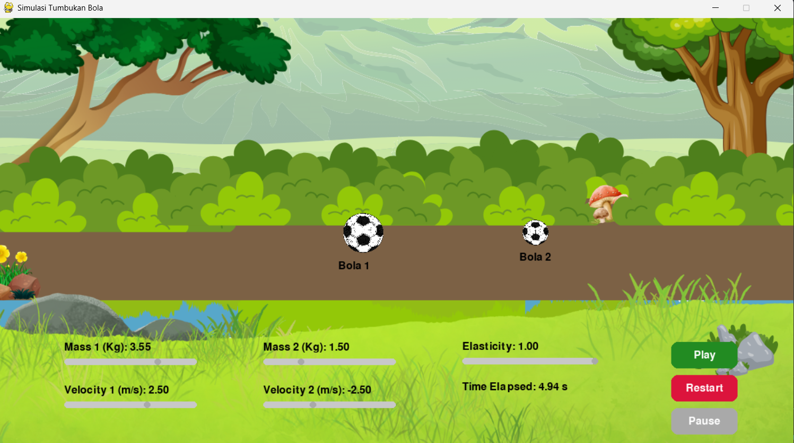

# Collision and Momentum Simulation

## Overview

An interactive physics simulation built with Python and Pygame to visualize elastic and inelastic collisions in real time. Users can adjust mass, velocity, and elasticity parameters to observe how different conditions affect collision behavior and momentum transfer.

## Project Background

This project was developed as part of a Computer Programming course to provide a more intuitive understanding of collision and momentum concepts. Through an interactive simulation environment, users can experiment with different physical parameters and observe the resulting motion and collision outcomes.

## Preview



## Features

- Adjustable mass values for both objects
- Adjustable velocity values
- Elasticity control for collision behavior
- Real-time collision simulation
- Play, pause, and restart controls
- Interactive visualization using Pygame
- Momentum and velocity calculations

## Technologies Used

- Python
- Pygame
- Physics-Based Simulation

## My Contributions

**Lead Developer & Concept Initiator (Group Project)**

Responsibilities:
- Proposed the project idea and simulation concept
- Implemented the simulation logic and physics calculations
- Developed the user interface using Pygame
- Integrated collision and momentum formulas
- Conducted testing and debugging

## Project Structure

```text
├── code/
│   └── collision_simulation.py
│
├── assets/
│   ├── background.png
│   └── ball.png
│
├── images/
│   └── preview.png
│
├── docs/
│   └── project_report.pdf
│
├── README.md
└── .gitignore
```

## Documentation

Detailed project documentation is available in:

- [Project Report](docs/project_report.pdf)

## Learning Outcomes

This project strengthened my understanding of:

- Physics-based simulation development
- Event-driven programming
- Graphical user interface design using Pygame
- Collision and momentum calculations
- Software debugging and testing
- Team collaboration in software development

## Conclusion

The simulation successfully demonstrates collision and momentum concepts through an interactive environment. By allowing users to modify physical parameters and observe outcomes in real time, the project provides a practical and engaging way to explore fundamental physics principles.

## Author

Annisa Primahapsari
